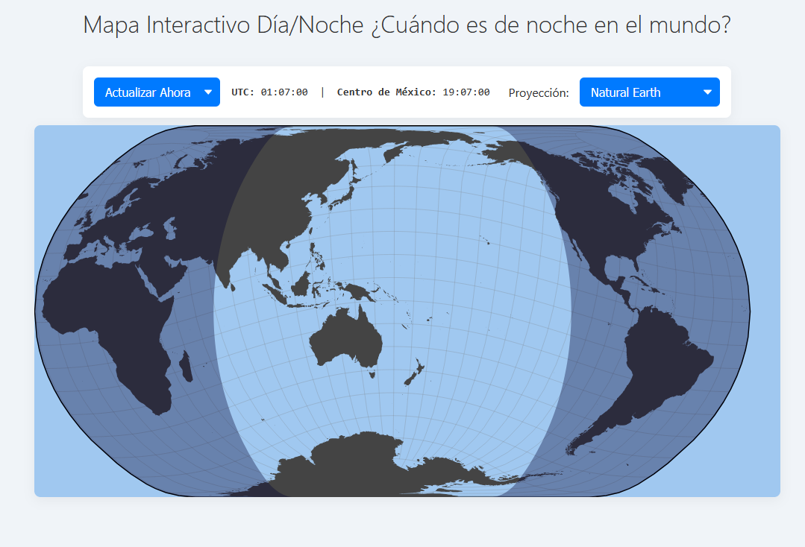
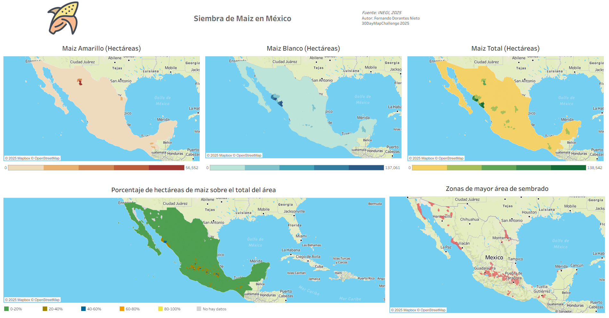

# 30DayMapChallenge 2025
Este es mi repositorio donde guardaré los códigos para hacer los mapas para el challenge.

Autor: Fernando Dorantes Nieto

Los mapas y demás se podrán ver en esta página web:
[FerDoranNie 30 Day Map Challenge 2025](https://ferdorannie.github.io/-Repo30DayMapChallenge2025/)

## Día 1:
### Mapa del día y noche en tiempo real
#### Software utilizado:
- Javascript

#### Origen de los datos 
No hay datos que alimenten este mapa, se tomó inspiración
de un trabajo de Mike Bostock: [Mapa Dia noche Bostock](https://observablehq.com/@d3/solar-terminator)

## Día 2:
### Siembra de maiz por municipio en México
#### Software utilizado:
- Python
- Tableau

#### Origen de los datos 
[Datos Inegi](https://gaia.inegi.org.mx/)

[Link a Tableau Public](https://public.tableau.com/views/Mapa_maiz_mexico/SiembradeMaizMexico?:language=en-US&publish=yes&:sid=&:redirect=auth&:display_count=n&:origin=viz_share_link)
